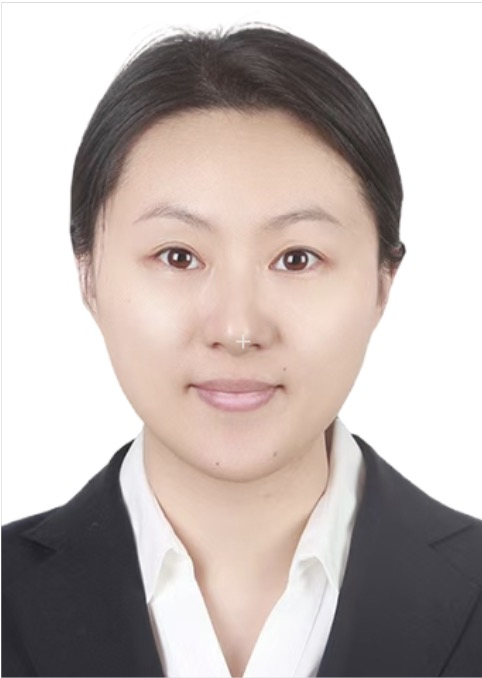

# 📄 CV

<!--
# 📄 CV

## Zhou Jin

 

**Hangzhou, China**  
**Email:** z.jin@zju.edu.cn  
**Github:** [GitHub Profile](https://github.com/dashboard)
**Google Scholar:** [Google Scholar Profile](https://scholar.google.com/citations?hl=zh-CN&user=Iw11vncAAAAJ&view_op=list_works&sortby=pubdate)
**ORCID:** [ORCID iD](https://orcid.org/0000-0002-0632-9494)

---

## Focusing on
Electronic Design Automation (EDA), VLSI CAD, Design Automation and Circuit Simulation.

---

## Current Position
**March 2025 - Present**  
Hundred-Talents Program Researcher  
Zhejiang University, School of Integrated Circuits

---

## Previous Positions
- **2023 - 2025**  
  Associate Professor, Doctoral Supervisor  
  China University of Petroleum (Beijing), School of Artificial Intelligence
- **2018 - 2022**  
  Lecturer, Master’s Supervisor  
  China University of Petroleum (Beijing), School of Information Science and Engineering
- **2016 - 2017**  
  Postdoctoral Researcher  
  Waseda University, Research Center
- **2013 - 2014**  
  GCOE Researcher  
  Waseda University, Global COE Program (21st Century Center of Excellence)

---

## Education Background
- **Ph.D. in Engineering (2012 - 2015)**  
  Waseda University, Department of Large-Scale Integrated Circuit Systems
- **M.Eng. in Engineering (2010 - 2012)**  
  Waseda University, Department of Large-Scale Integrated Circuit Systems
- **B.Sc. in Computer Science and Technology (2006 - 2010)**  
  Nanjing University, Department of Computer Science and Technology

---

## Honors and Awards
### Best Paper Awards
- SC ‘24 (CCF - A International Top - tier Conference)
  - Best Paper Award Nomination (2024)
- SC ‘23 (CCF - A International Top - tier Conference)
  - Best Paper Award
  - First recipient from Mainland China
  - Only winner at the conference (2023)
- ISEDA ‘23
  - Honorable Mention Paper Award (2023)

### Young Scientist Awards
- EDA² Open Innovation Collaboration Mechanism
  - Youth Science and Technology Award (First Edition, Sole Recipient) (2023)
- Institute of Electrical Engineers of Japan (IEE) Kyushu Branch
  - Kyushu Branch President’s Award (2013)
  
-->

### Academic Recognition
- Beijing Association for Science and Technology
  - Selected for “Capital Frontier Academic Achievements” (2024)
  - Selected for “Youth Talent Support Program” (2022 - 2024)
